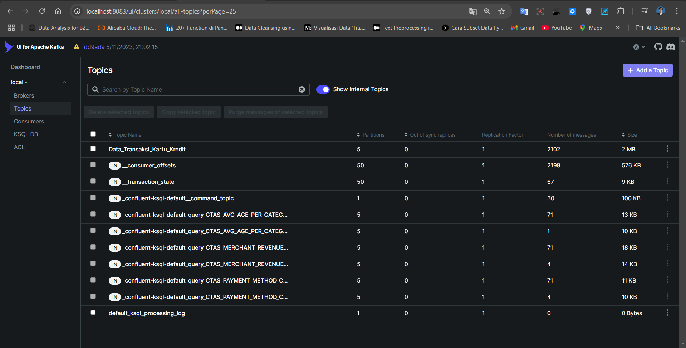
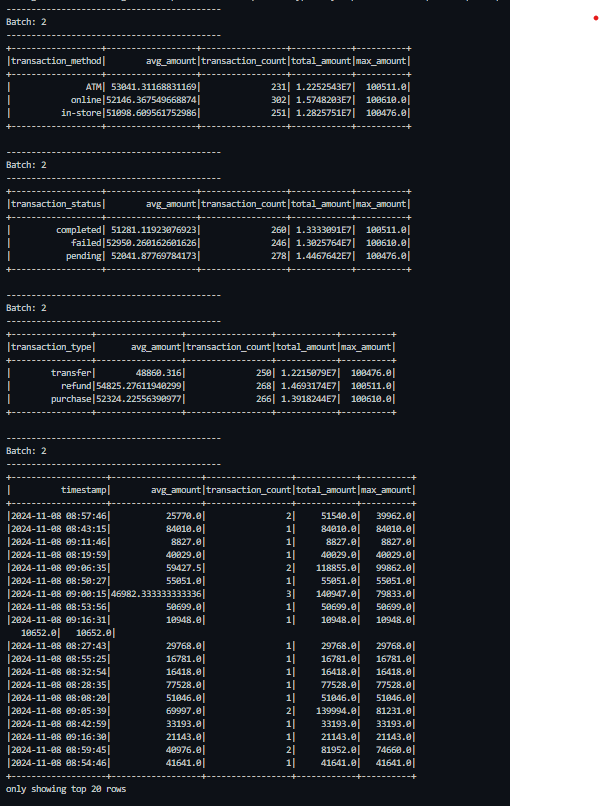

# Dibimbing-Ajied, Data Engineering Bootcamp

# Kafka

<div style="text-align: center;">
  
</div>

# Deskripsi Data
Proyek ini bertujuan untuk memproses data transaksi kartu kredit secara real-time menggunakan PySpark Structured Streaming yang terintegrasi dengan Kafka sebagai sumber data.
Data yang digunakan dalam proses streaming ini berkaitan dengan transaksi kartu kredit yang terjadi di berbagai merchant. Setiap transaksi berisi informasi yang penting untuk analisis, seperti detail transaksi itu sendiri, informasi pengguna, dan kondisi teknis transaksi. Data ini akan diproses menggunakan Spark Streaming untuk melakukan analisis secara real-time. Data transaksi dikonsumsi dari topik Kafka dan diolah untuk menghasilkan agregasi statistik pada beberapa kolom seperti waktu transaksi, tipe transaksi, status transaksi, dan metode transaksi. Output akan ditampilkan secara real-time di konsol.

# Run
1. Clone This Repo.
2. Run `make kafka`, Run `make spark`, Run `make spark-produce` and Run `make spark-consume`

---
```
## docker-build                 - Build Docker Images (amd64) including its inter-container network.
## spark                        - Run a Spark cluster, rebuild the postgres container, then create the destination tables
## kafka                        - Spinup kafka cluster (Kafka+Zookeeper).
## clean                        - Cleanup all running containers related to the challenge.
```

# Struktur Data
- transaction_id: ID unik untuk transaksi.
- timestamp: Waktu transaksi dalam UTC.
- user_id: ID unik pengguna.
- account_id: ID akun pengguna terkait transaksi.
- transaction_type: Jenis transaksi (misalnya, pembelian, tarik tunai).
- transaction_amount: Jumlah uang yang ditransaksikan.
- currency: Mata uang transaksi.
- merchant_id: ID unik untuk merchant.
- name_merchant: Nama merchant.
- category: Kategori merchant (misalnya, elektronik, makanan).
- city, state, country, zipcode: Informasi lokasi transaksi.
- phone, email: Kontak pengguna.
- card_id: ID kartu.
- card_type: Jenis kartu (kredit/debit).
- card_network: Jaringan kartu (Visa, MasterCard).
- expiration_date: Tanggal kadaluwarsa kartu.
- last_four_digits: Empat digit terakhir kartu.
- fraud_score: Skor risiko untuk penipuan.
- is_suspicious: Indikasi apakah transaksi mencurigakan.
- transaction_status: Status transaksi (selesai, gagal).
- transaction_method: Metode transaksi (misalnya, gesek, chip).
- device_type, os, app_version: Informasi perangkat dan aplikasi yang digunakan untuk transaksi.

# Dokumentasi

- Topic dengan nama: Data_Transaksi_Kartu_Kredit
<div style="text-align: center;">
    
</div>

- Output consume
<div style="text-align: center;">
    
</div>
