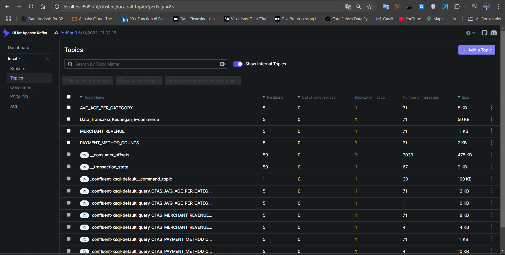
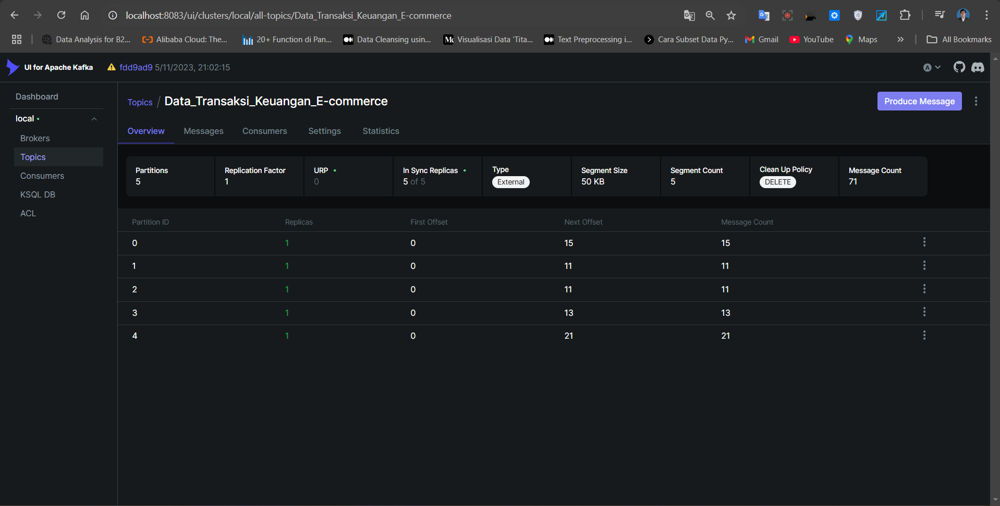
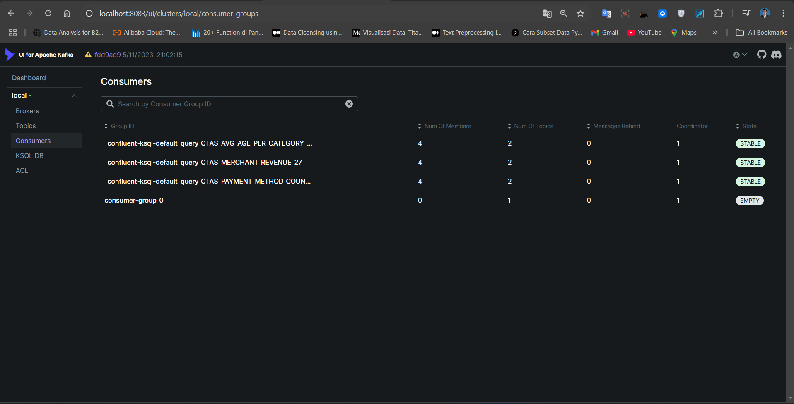
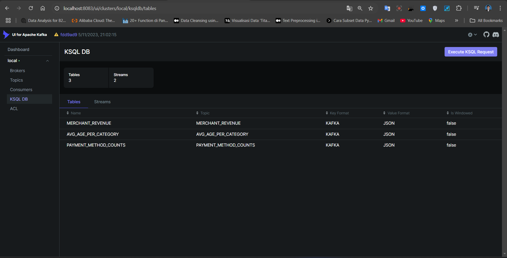

# Dibimbing-Ajied, Data Engineering Bootcamp

# Kafka

<div style="text-align: center;">
  
</div>

1. Clone This Repo.
2. Run `make kafka` and Run `make Jupyter`

---
```
## docker-build                 - Build Docker Images (amd64) including its inter-container network.
## jupyter                      - Spinup jupyter notebook for testing and validation purposes.
## kafka                        - Spinup kafka cluster (Kafka+Zookeeper).
## clean                        - Cleanup all running containers related to the challenge.
```

# Dokumentasi

-Topic ada 4 topic
<div style="text-align: center;">
    
</div>

- Partition ada 5 
<div style="text-align: center;">
    
</div>

- Consumer
<div style="text-align: center;">
    
</div>

- KSQL DB
<div style="text-align: center;">
    
</div>